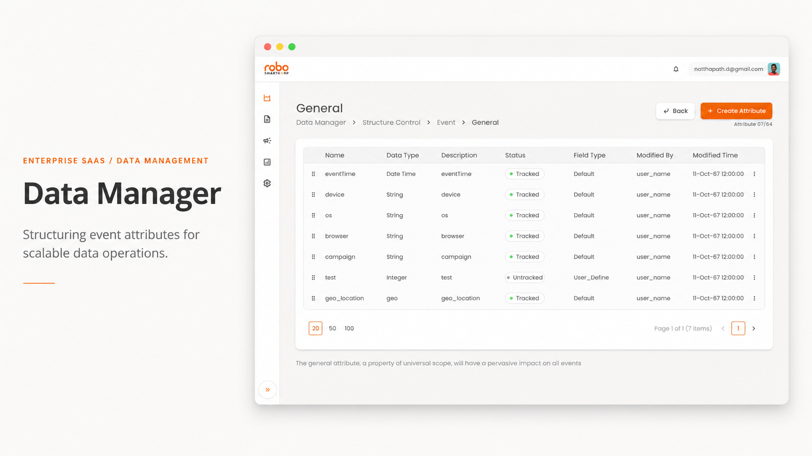
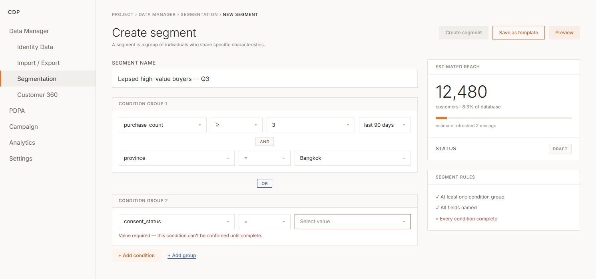
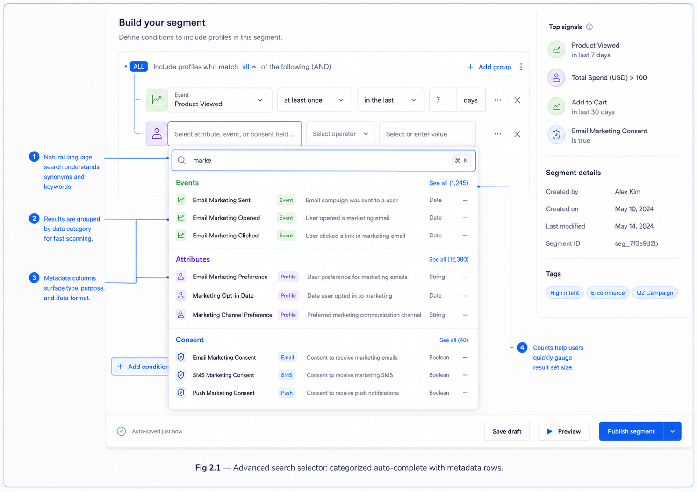
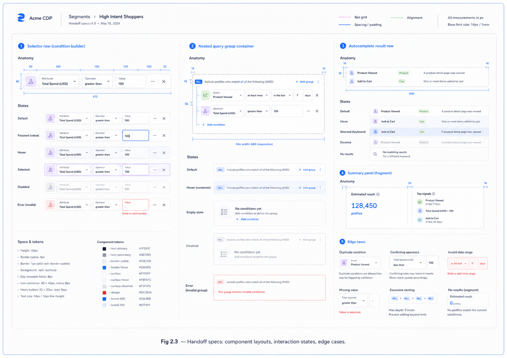
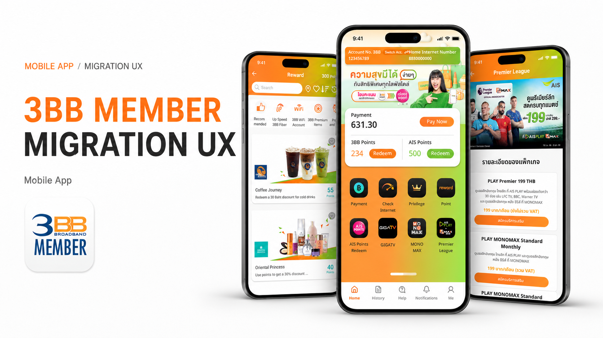
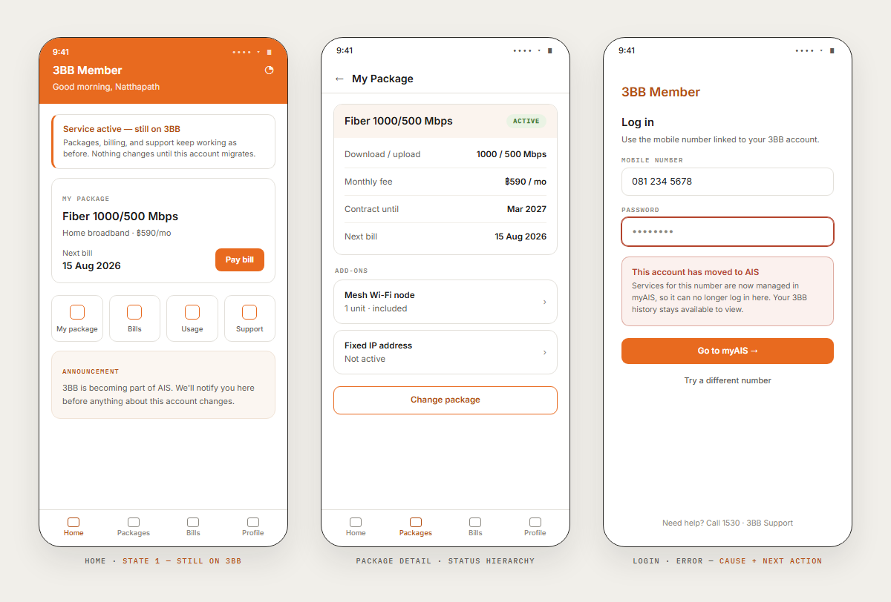
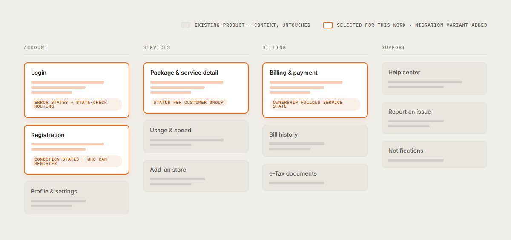
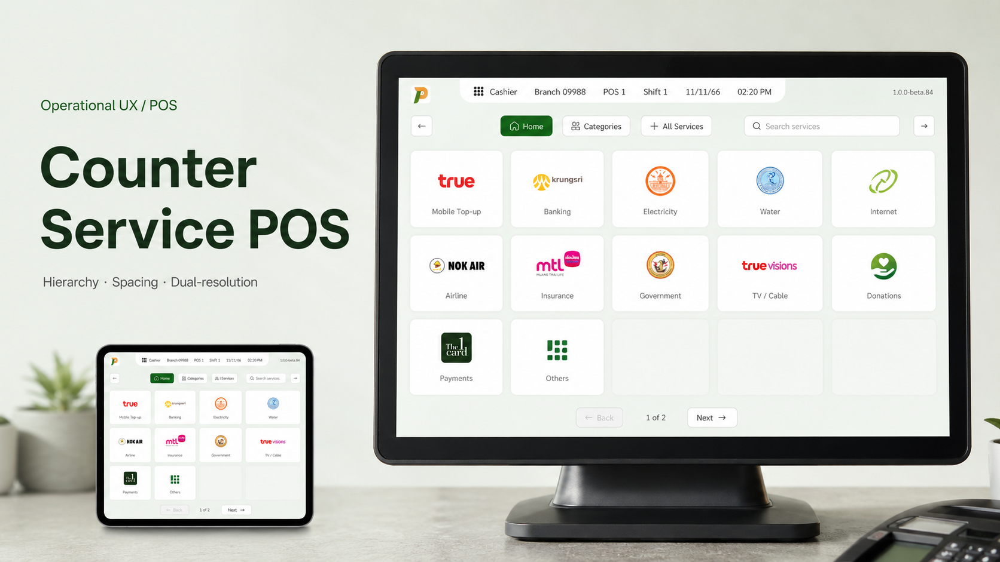
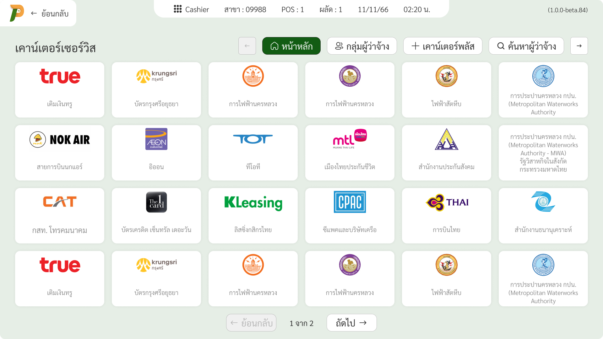
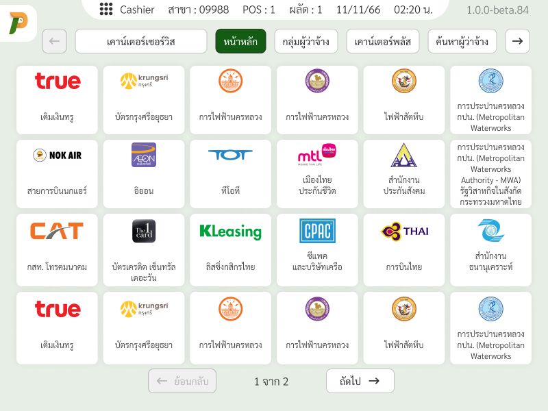

# Note — 2026-07-10 (Portfolio review, case consolidation, claim validation, and asset migration)

## What happened today

**1. Homepage visual hierarchy & branding updates.** Added owner's full name ("Natthapath Damrongsri" in a new `.hero-name` block) directly in the first viewport of `index.html`. Repositioned the Résumé CTA ("View résumé ↗") to sit alongside the "Get in touch" mailto button in a grouped flex layout (`.hero-actions`). Adjusted the main role label typography size and added mobile responsive styles to wrap the footer contact links on screens <= 360px.

**2. CDP case study consolidation & formatting.** Reduced the vertical length of `cdp.html` significantly by refactoring Decision 01. Merged three separate plates (Color ramps, Type scale, Buttons) into a single visual specimen (`Plate 01 — Foundation set`), displaying them in a 3-column grid layout (`.foundation`) on desktop that stacks on mobile. Completely removed the Wayfinding set plate (formerly Plate 04) to keep the layout concise and focused on high-value items (Identity setup progress tracker, Journey nodes, RFM).

**3. Claim validation & contribution alignment.** Swapped all instances of the "Outcome" label to "Delivery" or "Status" across `cdp.html`, `3bb-member.html`, and `counter-service-pos.html` to maintain factual integrity (as none have live production metrics). Added a dedicated "My contribution" section to `3bb-member.html` and `counter-service-pos.html` to clearly declare ownership over specific UX/UI tasks (mapping, state coverage, flows, specs) rather than full product metrics.

**4. Asset optimization & responsive images.** Replaced heavy PNG figures on the case study pages with optimized WebP versions (covers, screen previews, and UI figures). Configured `srcset` for project covers on the homepage (`index.html`) using 720w and 1440w responsive assets. Created dedicated open graph social preview images (`og.jpg` with `og:image:alt` tags) for each case study folder instead of sharing one global `og.png`.

**5. Clean deployment configuration.** Updated `_config.yml` to exclude scratch files, plan documents, and design reveal folders (`PLAN.md`, `note.md`, `cdp-editorial.html`, `_case-template.html`, and `design_handoff_homepage_reveal/`) from Jekyll builds, avoiding leaking internal files.

**6. Sub-agent sandbox workaround.** Attempted to delegate different page refactoring to Sub-agents A–E. However, Windows sandbox restrictions and shell timeouts prevented the sub-agents from reading or writing files. Fallback was successfully executed, applying all plan patches directly and synchronously via the lead Codex agent.

---

# Note — 2026-07-09 (continued — CDP accuracy pass, headline contract v3, PLAN.md retired)

## What happened today

**1. `cdp.html` editorial pass.** Rewrote the case around one throughline instead of scattered fixes: "a rule that isn't visible doesn't disappear — it moves downstream, and gets more expensive the longer it stays hidden." Renamed the three plate-group section labels to `Decision 01/02/03` (decision-first, not taxonomy-first); added a "The situation" section with concrete, rule-category pain bullets before the first evidence plate; added two `.hand` margin-note beats mid-page to break up the plate-after-plate rhythm; trimmed redundant restatement between the intro/spine/situation (situation section lost its bookending paragraphs, kept only the bullets + one throughline line); consolidated the "system at work" section to reference the inventory table instead of unverified figures.

**2. Product-screenshot authenticity caught and fixed.** The three original case figures (`fig-1-1.png`, `fig-2-2.png`, `fig-2-3.png`) turned out to be generic "Acme CDP"-branded mockups with tutorial-style numbered callouts — not real captures of the actual product, and not disclosed as such anywhere on the page. Removed all three, rewrote the section to run on the inventory table alone, then — per the user's follow-up — restored exactly one (`fig-1-1.png`) inside a new `.figs.one` layout (page-scoped CSS in `cdp.html`), captioned and alt-texted as "recreated," with the site's existing honesty note extended to cover it explicitly.

**3. Major factual correction: the CDP was never shipped.** The user caught that the case had drifted into claiming a live, in-production product ("marketing teams ran real campaigns on it every day," Outcome: "Shipped — dev built from specs," a table header reading "shipped in," etc.) — false. Ground truth: the CDP is still in development (~1 year total build time), nothing has launched, and the user's own engagement was 4 months (not 3), joining as an outside design lens on a team already building it, auditing what existed first, then building the missing design system and screens in close collaboration with dev. Corrected roughly a dozen instances across meta tags, the intro, Outcome/Timeline meta, the story spine, the situation bullets, both Decision sections, the "system at work" section, the table header, and both reflection blocks — reframing realized-harm language ("created unmatched records," "goes out to nobody") as prospective risk ("would create... once real data started flowing"), and adding an explicit pre-launch disclosure to the honesty note. Saved as project memory (`cdp-project-status-context.md`) so this doesn't drift back.

**4. `doc-id` removed sitewide.** The small sector/mechanism/year tag line under `ed-nav` on every case page read as redundant with (and inconsistent with) the h1 below it. Removed the `
` block entirely from `cdp.html`, `3bb-member.html`, `counter-service-pos.html`, and `_case-template.html`.

**5. `.stat` card layout flipped to vertical, sitewide.** Changed from side-by-side (`grid-template-columns:auto minmax(0,1fr)`) to stacked (`display:flex;flex-direction:column`) in `style.css` — number on top, label below — applied to all three case pages via the shared rule (there was a brief detour through a page-scoped-only version, reverted once the user clarified they wanted it global).

**6. Headline Contract v3 — h1 hierarchy reversed, on purpose, over a prior documented rejection.** `PLAN.md`'s own J1 section had explicitly considered and rejected flipping the case-page h1 to lead with the large project name ("situation line คือประตูเข้าเรื่องของหน้า case... ชื่อโปรเจกต์ใหญ่ซ้ำกับ kicker จะเหลือหน้าที่อะไรให้ตัวเอง"). Surfaced that rejection to the user before touching anything; the user reconsidered — partly because removing `doc-id` (item 4) already weakened the "nothing left for the page to own" argument — and confirmed the flip. Renamed `.t-kicker` → `.t-sub` in `style.css` (now a small sans subtitle *below* the h1, not small mono-caps *above* it) and swapped the markup order in all four files: project name is now the large serif h1 text, the situation line is the small `.t-sub` line under it. Updated `_case-template.html`'s contract comment block and checklist to document v3 so future case pages don't get built against the stale v2 rule.

**7. `PLAN.md` verified complete, then deleted.** Its own header claimed "100% done (Implemented & Verified)," but the file had an internal contradiction (top summary marks R9/screenshot-QA done; §2.4 body text says no evidence was found) — worth checking before trusting. Spot-verified ~15 claims directly against live files rather than trusting the document: `script.js` absent (R6 ✓), `robots.txt`/`sitemap.xml` present (F5 ✓), `qa-artifacts/` genuinely contains Playwright screenshots + a `qa_playwright.py` script dated today (R9 ✓ — the §2.4 contradiction was just the doc not being updated after the fact, not a real gap), hero thesis/card headline/About copy on `index.html` match the Figma spec verbatim (H1 ✓), and the type scale in `style.css` is genuinely down to the chosen 8-token package (H9/J3 ✓). Found exactly one trivial drift (`.proj-row` third column is 360px live vs. 320px in the spec) — cosmetic, not worth blocking on. Everything else the plan claimed done, was done. Deleted the file; this note plus the git-free file history are now the only record of that work.

---

# Note — 2026-07-09

## What happened today

Came back to continue `PLAN.md` (written 2026-07-08, 11:36 — status said "pending
review, not yet implemented"). Before writing anything new, audited every
proposal in it against the actual live files, because their save timestamps
(14:53–14:54 on the 8th) are **later** than the plan itself — something
happened between 11:36 and 14:53 that was never logged anywhere.

**Finding: nearly all of PLAN.md (sets A–F) was already implemented,
faithfully, matching the plan's own recommended options** — the token system
fully migrated into `style.css` (§2.2's spec is byte-for-byte what's live
now), the B1/B2/B3 evidence fixes applied, all 4 accessibility items, the D1
contact line, 11 of 12 copy fixes, and F1–F4 meta/font/image work. No note
here or status update in PLAN.md ever recorded that round happening, or
who/what did it.

Rewrote `PLAN.md` to match true state: every item now stamped ✅ DONE with
file:line evidence, or kept open as R1–R10 in a much shorter remaining-work
list. Section 2 (token rules) kept at the same heading number on purpose —
`style.css`:8 and `_case-template.html`:43 both hardcode "PLAN.md §2" as
their reference, so the section identity had to survive the rewrite.

**New findings, from testing instead of just reading:**
- Ran the draft guard-script (`check-tokens.sh`) logic against the real
  `style.css` — it was never actually created as a file, only described.
  Running it surfaced 2 false-positive classes (breakpoint values inside
  `@media(...)`, and layout max-width/grid-template-columns that were never
  in scope) plus 2 real but already-commented exceptions the original regex
  didn't recognize (`/* = --d3 floor */`-style comments). Fixed the script
  spec (PLAN.md §2.5 v2) before handing it off — the old draft would have
  been noisy enough to just get ignored.
- One real untokenized value survives: `.h-open::before{font-size:8px}`
  (`style.css`:100) — no token, no `art:` comment.
- `_case-template.html`'s title placeholder still has "· Natthapath
  Damrongsri" appended — the three live case pages all correctly dropped
  that suffix (per the plan's own F2), but the template boilerplate was
  never updated to match, so the next case built from it would silently
  reintroduce the problem.
- The plan required before/after screenshot QA (1280px/390px, all 4 pages)
  before considering the token migration done. No screenshots exist
  anywhere in this folder, so that check likely never happened — even
  though the change it was meant to verify is already live.

## Later the same day (afternoon)

- Both open questions answered: **no availability line** (R1 closed),
  **skip the hard_id/soft_id gloss** (R2b closed). Zero open questions
  remain on the original review plan.
- The `explorations/` and `codex-plugin-cc-main/` folders disappeared
  mid-session — resolved: **the user deleted them intentionally**
  ("ไม่น่าได้ใช้แล้ว"). G2/R7 (the dead link inside explorations) is moot.
  Note: the Specimen exploration originals (specimen-3bb.html,
  specimen-pos.html, cdp/ five directions) are gone with it — the live
  pages are now the only copy of that layout lineage.
- **New workstream: readability (PLAN.md §11, set H).** User received
  feedback that the portfolio is too hard to read for non-designers and
  HR. Diagnosis + a "two reading lanes" approach are written up in §11;
  final scope is blocked on the user's Figma file (they've already
  re-sequenced the desktop layout and per-project rows there — awaiting
  the share link to pull via Figma MCP).

## Open items

- H1 is fully specced and unblocked (PLAN.md §11.5): Figma pulled
  (file 4HrxyWNh5P16Z6Yza1L3W2, desktop 4131:15190 + mobile row
  4138:9652), all four layout decisions answered (cut Around the
  table/habits/Decision rows; keep radius 0; keep 1240; new hero
  headline chosen — draft จ, "Complexity is my job, so it isn't the
  user's."). Ready to hand to an execution agent.
- All decisions now closed (afternoon, second round): **type scale =
  package 8** (14 tokens → 8: fixed 11·13·16·18·22·28 + d-section +
  d-hero; case body 15→16, both h1s become one size ~64) and
  **no employer names** (Résumé stays the only verifiable history;
  H2/J2 copy must stay product-first, no invented company hints).
  Sets added same day: I (cdp Plate 04/05 mobile, §12), J (case pages
  → new system, §13), K (mobile spacing rhythm, §14).
- Nothing in the plan is blocked on the user anymore — every remaining
  item (R9, R6, R8, R5, R3, R4, R2, R10, I1–I2, H1–H9, J1–J6, K1–K3)
  is executable; order in §9.
- User will rename the folder `03 July` → `fight-me` themselves (rename
  from inside the session failed — the CLI process locks the cwd).
  After rename, auto-memory is keyed to the old path and starts fresh;
  PLAN.md/note.md carry all context and move with the folder.
- Everything else left (script.js deletion, the dead `explorations/index.html`
  link, the template title fix, the 8px value, robots.txt/sitemap.xml, the
  guard script, PDPA gloss) has zero remaining ambiguity — see `PLAN.md` §9
  for the recommended order.
- Screenshot QA of the already-shipped token migration is unverified and,
  since it's live, is arguably the highest-priority remaining item even
  though it isn't blocked on anything.

---

# Note — 2026-07-08

## What happened today

1. **Nav brand unified.** Every page now shows **"ND"** in the home nav's
   face (`Newsreader 400 · 22px`) — was "N." on home, full name in 14px
   Inter on case pages. One shared `.brand` rule (class renamed
   `mono → brand` to stop colliding with the `--mono` font variable);
   `.site-nav`/`.ed-nav` now share one box rule so the nav band is
   identical on every page. Full name kept as `aria-label` + footer.
   **Favicon redrawn "N" → "ND"** on all pages + template. Explorations
   untouched (archive, self-contained CSS).
2. **Headline contract applied — the home card set is canonical.** Case h1
   is now a two-deck: `.t-kicker` (project name, 12px mono caps) + the
   situation line, word-for-word the home card's `pr-headline`; `pr-title`
   = the kicker. `<title>`/og:title = "Project — Situation line" on all
   three cases. CDP card's `pr-title` trimmed to "Customer Data Platform";
   cdp doc-id de-duped to "Enterprise SaaS"; pos doc-id → "Retail ·
   Operational UX". `.t-h` measure 22ch → 26ch + `text-wrap:balance` —
   kills the mid-phrase wraps ("three levers, zero / moves"). The old
   angles live on in doc-id mechanism tags / descriptions.
3. **One spacing scale, two frames.** Shared gutter tokens (`--gutter`
   48px / `--gutter-m` 22px, both frames switch at 860 — home was 56,
   case switched at 600); nav band 28px 0 22px everywhere; breakpoint
   ladder unified to **1080 / 860 / 700 / 600** (case-page 760→700,
   640→600 across style.css + page style blocks); case `<footer>` moved
   outside `.wrap` so its hairline runs full-bleed like home. Frame
   widths stay 1240 / 1040 (deliberate: index grid vs reading column).
4. **Mobile fixes.** cdp `.legend` min-width 280px overflow bug →
   `min(280px,100%)` (was forcing horizontal scroll ≤~360px); cdp `.trow`
   type-scale rows stack ≤600 (no more "Custo…" ellipsis, display specimen
   36px); `.used`/`.cov` first columns may wrap ≤600; home `.pin-note`
   sits under the cover ≤600 instead of overlapping half the image.
5. **Template + fonts.** `_case-template.html` rewritten to the headline
   contract (grammar bullet + checklist item + two-deck h1 markup);
   Newsreader italic-400 added to cdp.html and the template (was missing
   vs. the other pages — `.req-quote` needs it).

6. **Full outside-reader review (Claude + Codex as second reviewer).**
   Both reviews done end-to-end; findings logged in the session. Two were
   acted on immediately: the `.pin-note` ≤600px rule needed `display:block`
   (span is only blockified by position:absolute at desktop; relative
   doesn't blockify, so width/margin/transform were silently ignored —
   caught by Codex via headless-Chrome render, fixed in style.css); and
   two live-site facts were verified by HTTP check — **the Résumé Drive
   link returns 401 to logged-out visitors** (permission wall; must be
   fixed in Drive share settings, not in code) and **og.png actually
   exists on the deployed site (200)** — this Downloads folder just isn't
   the full repo checkout.

## Open items

- **Résumé link is broken for outsiders (HTTP 401)** — fix in Google
  Drive: Share → "Anyone with the link · Viewer", then retest logged out.
  Highest-stakes item on the site: no case page names an employer, so the
  résumé is the only verifiable history.
- Review findings pending decision (see session summary): evidence
  overclaims on cdp Plate 05 (identity gate not in the shown tracker) and
  Plate 07 (RFM "9-state / config tables" not rendered); `--faint` fails
  WCAG AA (~3.3:1) on real captions; no contact path on case pages;
  copy/idiom list ("Connect Me", "continuable", knew/know, "hold on",
  "unlocked", "analytic templates", million vs millions…); twitter:card
  only on index; case <title> 90–95 chars; unused font axes (Inter 600,
  Caveat 400/600, Newsreader upright-500); figs lack width/height/lazy.
- ~~og.png missing~~ — exists on the deployed site (verified 200); keep it
  when deploying, nothing to export.
- canonical/og URLs spell the repo "portfoilo" — matches the live site,
  so correct as-is.
- `script.js` still unreferenced (safe to delete whenever);
  `explorations/index.html` D1 → `details/index.html` dead link still
  pending a decision.

# Note — 2026-07-07

## What happened today

**The whole site's case-study layer was rebuilt around the "Specimen" layout.**

1. **CDP case rewritten** from the narrow segment-builder story to the system-level
   story ("Making an Existing CDP Legible", 6 chapters) — first as the old
   tile/cluster layout, which was then superseded the same day (see 4).
2. **Layout explorations for CDP** built at `explorations/cdp/` — five directions,
   lettered F–J to continue the A–E series: Stack (architecture cross-section),
   Atlas (product-IA as page chrome), **Specimen** (the work re-set live in HTML
   plates), Gate (setup-wizard narrative), Census (scope audited as tables).
   All self-contained, noindex, generating evidence from content structure so
   none depends on pending Figma exports.
3. **Specimen selected (H ★)** and ported to the other two cases as
   `explorations/specimen-3bb.html` (built on the new 3BB→AIS three-state
   context: still-3BB / migrated / waiting, each needing status + explanation +
   next action) and `explorations/specimen-pos.html` (the three levers —
   spacing, grouping, contrast — demonstrated on identical geometry).
4. **Live rebuild — all three case pages replaced** with Specimen versions:
   - `style.css`: old case grammar (tile/cluster, split-pane rail, flow-strip)
     removed; new shared grammar added (doc-head → spine → sect-label +
     statement + plates/figures → refl → case-nav). Case wrap 1128 → 1040px.
   - Page-specific plate CSS lives in each page's own `<style>` block;
     brand/product colors allowed only inside plates; honesty note mandatory.
   - `cdp.html` (7 plates), `3bb-member.html` (state cards, routing tree,
     messaging set, coverage — no longer loads script.js), and
     `counter-service-pos.html` (locked-vs-adjustable ledger, same-geometry
     pair, two screen profiles). IBM Plex Mono added to case-page font links.
   - Verified: all links/assets resolve; every class used is defined.
5. **Homepage adjustments**: "Who made this" → "About" (id `#who` kept);
   `.h-open` button finalized as "Connect Me", ghost→tint outline style
   (transparent rest, green tint on hover — option A from a live comparison
   file `text.html`, since deleted); `.proj-row` hover = panel wash
   (option A: whole row gets `--panel` background, 24px side bleed, 22px on
   mobile to avoid overflow). Cards 01 (CDP) and 02 (3BB — "One product,
   three customer realities") rewritten to match the new case framings.
6. **`_case-template.html` rewritten** as the Specimen boilerplate — grammar
   rules, plate honesty rules, and the CSS split documented as comments.
7. **Claude memory updated**: 3BB three-state context saved as the source of
   truth and marked applied to the live page.

## Decisions locked

- Specimen is the case-page layout for all three cases; explorations remain
  as archive.
- CSS split: shared grammar in `style.css`, per-case plate internals in each
  page's `<style>` — one case's artifacts must not leak into another.
- Product/brand color only inside plates; the frame stays paper + ink.
- Every re-set artifact carries an honesty note (representative values,
  simplified mockups, paraphrased quotes — named plainly).

## Open items

- `explorations/index.html` D1 entry links to `details/index.html` — folder
  does not exist on disk (pre-existing dead link). Delete entry or restore
  folder; pending decision.
- `og.png` is referenced by every page's `og:image` but is **not on disk** —
  verify it exists in the deployed repo before the next deploy, or export one.
- `script.js` is no longer loaded by any page (the split-pane rail it served
  is gone) — safe to delete whenever.
- From the 2026-07-03 items: the baked-captions (#2) and scan-size (#4) image
  problems now only affect the real figures still in use (cdp fig-1-1 / 2-2 /
  2-3, 3bb fig-1-1 / 2-1, pos screen_proof / fig-2-1) — the Specimen plates
  replaced everything else, and the CDP "pending export" figures are no
  longer needed at all.

---

# Note — 2026-07-03 (previous — kept for history)

> Status update 2026-07-07: the `*-synthesis.html` drafts described below no
> longer exist on disk; the live pages have since been rebuilt as Specimen
> layouts, so the index-link mismatch is moot.

## Context

Followed up on yesterday's (2026-07-02) synthesis-draft work. Three new case-study
detail pages were built late yesterday:

- `cdp-synthesis.html` — saved 17:11
- `3bb-member-synthesis.html` — saved 17:12
- `counter-service-pos-synthesis.html` — saved 17:13

`index-synthesis.html` (the homepage draft that links to them) was saved earlier,
17:05 — before the three detail pages existed.

## Audited today

**Detail pages — content is complete.**
- All three read as finished statement-first drafts: title block, cover figure,
  story spine, 4–5 numbered chapters (situation → decisions → reflection),
  case-nav footer. No lorem ipsum, no TODO markers, no missing sections.
- Every `` referenced (`cover.png`, `fig-1-1.png`, `fig-2-1.png`,
  `fig-2-2.png`, `fig-2-3.png`, `screen_proof.png`) exists on disk — verified
  with a file-existence check across all three projects' asset folders.
- Inter-page navigation is correct and closes the loop:
  `cdp-synthesis → 3bb-member-synthesis → counter-service-pos-synthesis → index-synthesis#work`,
  and each "back"/name link in the nav points to `index-synthesis.html`.

**Found: `index-synthesis.html` project cards still link to the old live pages,
not the new drafts.**
- Card 01 (CDP): `href="cdp.html"` — should be `cdp-synthesis.html`
- Card 02 (3BB): `href="3bb-member.html"` — should be `3bb-member-synthesis.html`
- Card 03 (POS): `href="counter-service-pos.html"` — should be `counter-service-pos-synthesis.html`

Likely cause: the index draft was written first, before the detail drafts existed,
so it pointed at the only real pages available at the time (`cdp.html` etc.).
When the three detail drafts were finished ~6–8 minutes later, the index links
were never updated to match. Result: opening `index-synthesis.html` and clicking
any case card currently exits the draft and lands on the old live page instead
of the new one.

**Not yet fixed** — pending user confirmation before editing.

## Assets (copied here for reference)

**CDP**

**3BB Member**

**Counter Service POS**

## Still open from before (unrelated to today's find)

Carried over from `docs/image-assets-todo.md` — images used by both the live
pages and these synthesis drafts still have the pre-existing problems (#2 baked
captions, #4 illegibility at scan size) that were never re-generated. The
synthesis drafts inherit these same image files, so fixing the index links
does not fix the image issues — that's a separate, already-tracked item.

---

# Note — 2026-07-09 (PLAN.md execution)

Implemented the remaining live-file work from `PLAN.md` after the design-token pass:

- Removed the unreferenced `script.js`.
- Added `robots.txt`, `sitemap.xml`, and `check-tokens.sh`.
- Updated `_case-template.html` to Headline Contract v2 and removed the author suffix from the placeholder `<title>`.
- Reworked the home project cards so the visible headline is the project name, with shorter HR-readable descriptions and shared meta vocabulary.
- Cut the old Around the table section, decision rows, and habits list from the live home page.
- Migrated the shared type scale to the selected 8-step package and adjusted case-page rhythm for mobile readability.
- Added stats rows to all three case headers and rewrote the intro/spine copy to read as direct summaries.
- Fixed CDP mobile tabs/tracker wrapping and reduced the 3BB routing tree's mobile footprint.

QA evidence:

- `qa-artifacts/pw-index-desktop.png`, `pw-index-mobile.png`
- `qa-artifacts/pw-cdp-desktop.png`, `pw-cdp-mobile.png`
- `qa-artifacts/pw-3bb-member-desktop.png`, `pw-3bb-member-mobile.png`
- `qa-artifacts/pw-counter-service-pos-desktop.png`, `pw-counter-service-pos-mobile.png`

Verification run:

- Token guard fallback passed for `style.css`.
- Playwright overflow/console QA passed for all four live pages at 1280×1000 and 390×1000: no page-level horizontal overflow and 0 console messages.
